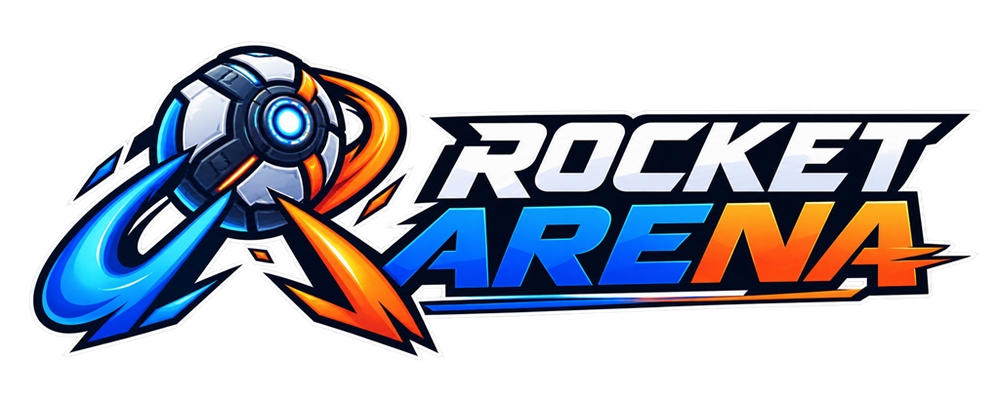

<h1 align="center">
  
</h1>

A browser-based 2v2 multiplayer car-ball game inspired by Rocket League, built with procedural gameplay geometry and original, locally bundled brand art.

## The Problem

There is no open-source, text-only, instantly-runnable Rocket League clone that a judge can `git clone` and play in under two minutes. Rocket Arena fills that gap: two teams of two drive physics-driven cars in a walled arena, knocking an oversized ball into the opposing goal. No assets to download, no accounts to create, no database to provision.

## Approach

- **Authoritative server** — Rapier 3D physics runs at 60Hz on the server. Clients send inputs only; the server owns all state.
- **Procedural gameplay visuals** — Every gameplay mesh is built from Three.js primitives (boxes, spheres, cylinders). Original reviewed 2D brand images are bundled locally for presentation only; no downloaded 3D assets define gameplay or collisions.
- **Configurable constants** — Every physics number lives in `shared/src/constants/` with a frozen-default + mutable-override architecture and a live dev panel for tuning without restarts.

## AI-Generated Brand Art

The lobby wordmark, compact mark, and favicon are original 2D images generated with ChatGPT by OpenAI under participant direction, then human-selected, reviewed, and optimized for local use. They are presentation-only and are never loaded from remote URLs at runtime. See [`docs/asset-provenance.md`](docs/asset-provenance.md) for per-asset provenance, dimensions, purpose, and review notes.

## Quick Start

```bash
git clone https://github.com/EndPx/Rocket-Arena.git
cd Rocket-Arena
npm install
npm run dev
```

This starts both the Colyseus server (ws://localhost:2567) and the Vite client (http://localhost:3000). Open two browser tabs to play.

## Controls

| Key | Action |
|-----|--------|
| W / Up | Accelerate |
| S / Down | Brake / Reverse |
| A / Left | Steer left |
| D / Right | Steer right |
| Space | Jump |
| Shift | Boost |
| ` (backtick) | Toggle dev panel (dev mode only) |

## Architecture

```
┌─────────────────────────────────────────────────────────────────┐
│  BROWSER                                                        │
│  ┌───────────┐  ┌─────────────────────┐  ┌─────┐  ┌─────────┐ │
│  │ Renderer  │  │ Interpolation Buffer│  │ HUD │  │Dev Panel│ │
│  │ (Three.js)│  │ (~66ms lag)         │  │     │  │         │ │
│  └───────────┘  └─────────────────────┘  └─────┘  └─────────┘ │
└────────────────────────────┬────────────────────────────────────┘
                             │ WebSocket (Colyseus 0.15)
                             │ ▲ state patches (33ms)
                             │ ▼ input payloads
┌────────────────────────────┴────────────────────────────────────┐
│  SERVER                                                         │
│  ┌──────────────────┐  ┌──────────────────┐  ┌──────────────┐  │
│  │ Rapier 3D Physics│  │ Colyseus Room    │  │   Systems    │  │
│  │ (60Hz step)      │  │ (state sync)     │  │ scoring      │  │
│  │                  │  │                  │  │ timer        │  │
│  │                  │  │                  │  │ kickoff      │  │
│  │                  │  │                  │  │ match flow   │  │
│  └──────────────────┘  └──────────────────┘  └──────────────┘  │
└────────────────────────────┬────────────────────────────────────┘
                             │
┌────────────────────────────┴────────────────────────────────────┐
│  shared/                                                        │
│  ┌─────────────────────────┐  ┌────────────┐  ┌─────────────┐  │
│  │ constants/              │  │ types/     │  │ schema/     │  │
│  │ car, ball, arena,       │  │ input      │  │ GameState   │  │
│  │ netcode, physics,       │  │            │  │ PlayerState │  │
│  │ resolver                │  │            │  │ BallState   │  │
│  └─────────────────────────┘  └────────────┘  └─────────────┘  │
└─────────────────────────────────────────────────────────────────┘
```

**Boundary rules:**

- `shared/` imports nothing from `client/` or `server/`
- `client/` and `server/` never import each other
- All Rapier code lives in `server/` only
- No magic numbers — all physics values come from `shared/src/constants/`

## Tech Stack

| Layer | Technology | Why |
|-------|-----------|-----|
| Physics | Rapier 3D (WASM) | Stable CCD for fast rigid bodies; no tunneling |
| Server | Colyseus 0.15 | Authoritative rooms, state sync, matchmaking |
| Client | Three.js | Procedural gameplay geometry with local, documented 2D brand art |
| Language | TypeScript (strict) | Shared types prevent client/server drift |
| Build | Vite | Fast HMR for client iteration |
| Netcode | Interpolation buffer | Smooth rendering at 2x patch interval behind server |

## Game Rules

- **Teams:** Blue vs Orange, 2 players each
- **Match:** 5 minutes; golden-goal overtime if tied
- **Scoring:** Ball fully enters goal → point + 3s reset → kickoff
- **Matchmaking:** Quick Match (join-or-create) or Custom Room (6-char code, min 2 to start)

## How Kiro Was Used

This project was built using [Kiro](https://kiro.dev), an AI-powered development environment. The entire workflow followed a spec-driven approach — from spec to ship.

### Steering Files (`.kiro/steering/`)

| File | Purpose |
|------|---------|
| `product.md` | Game design, entry points, non-goals, definition of done |
| `tech.md` | Hard tech constraints (Rapier, Colyseus, Three.js, no assets) |
| `structure.md` | Repo layout, boundary rules, conventions |

### Custom Agents (`.kiro/agents/`)

| Agent | Role |
|-------|------|
| `physics-tuner` | Adjusts car/ball constants and validates feel via bench scripts |
| `bot-client` | Headless client that joins rooms and exercises game flow |
| `boundary-checker` | Enforces import boundaries between shared/, client/, server/ |
| `spec-auditor` | Reviews implementation against spec requirements |
| `submission-writer` | Generates demo scripts and submission artifacts |

### Spec-Driven Development

The implementation plan lives in `.kiro/specs/rocket-arena/implementation-plan.md` — a 20-task breakdown revised through critical feedback before code was written. Key design decisions (traction model, mass ratios, patch rates, sandbox room) were locked in spec before implementation.

## Project Structure

```
Rocket-Arena/
├── .kiro/              # Kiro steering, specs, and agents
├── bench/              # Physics tuning harness scripts
├── client/             # Three.js renderer, input, HUD, networking
├── docs/               # Architecture docs, demo script
├── server/             # Colyseus rooms, Rapier physics, game systems
├── shared/             # Constants, types, Colyseus schemas
└── tools/bot-client/   # Headless test clients
```

## Testing Instructions (for judges)

1. Clone and install:
   ```bash
   git clone https://github.com/EndPx/Rocket-Arena.git && cd Rocket-Arena && npm install
   ```
2. Start:
   ```bash
   npm run dev
   ```
3. Open http://localhost:3000 in 2–4 browser tabs
4. Join via Quick Match or create a Custom Room
5. Drive cars into the ball, score goals, watch the timer

No external services, no API keys, no database. Everything runs locally.

## License

MIT
